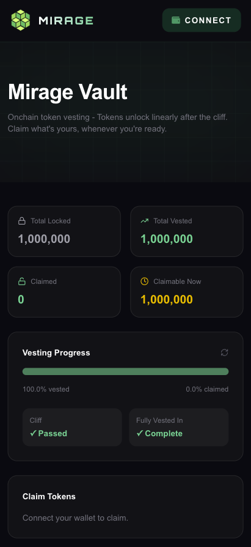
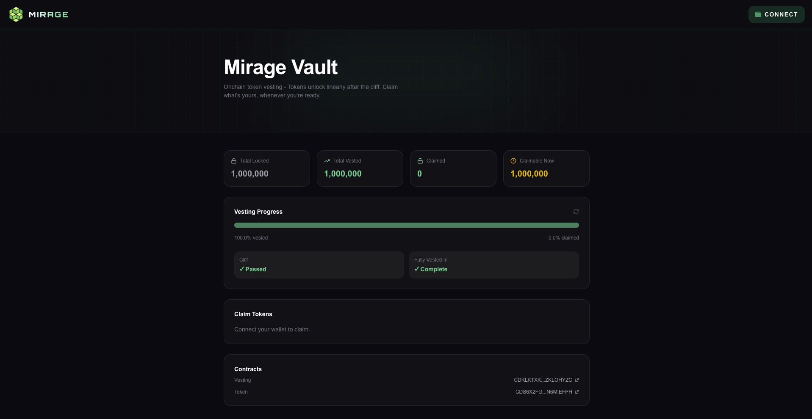
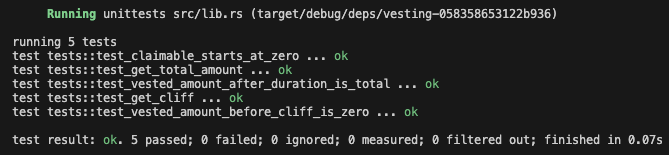
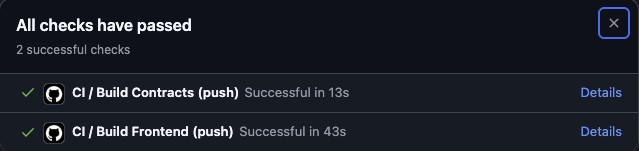

# Mirage Vault

A token vesting dashboard built on Stellar/Soroban. Tokens vest linearly after a cliff period — beneficiaries can claim their unlocked allocation at any time via a live on-chain dashboard.

## Live Demo

> [https://miragevault.vercel.app](https://mirage-vault.vercel.app)

---

## Screenshots

### Mobile Responsive UI


### Homepage


### Test Output


### CI/CD Pipeline



---

## How It Works

Mirage Vault uses a linear vesting model with a configurable cliff:

1. An admin deploys and initializes the vesting contract with a beneficiary, total amount, cliff, and duration
2. Admin deposits tokens into the vesting contract to fund the schedule
3. Before the cliff passes → `vested_amount()` returns `0`
4. After the cliff → tokens vest linearly each second until `duration` is reached
5. Beneficiary calls `claim()` at any time to receive all currently unlocked tokens
6. The dashboard reads on-chain state in real time — vested %, claimable balance, and countdown timers update live

---

## Architecture

Two Soroban smart contracts power the vault, with a Next.js frontend on top.

```
.
├── contracts/
│   ├── vesting/      # Core vesting logic — cliff, linear unlock, claim
│   └── token/        # Project token — mint, transfer, balance, allowance
└── app/              # Next.js 14 frontend
    └── lib/
        └── vesting.ts  # Contract config — IDs, cliff, duration
```

### Contract Flow

```
Deploy token contract
Deploy vesting contract
Initialize token  →  admin = deployer
Initialize vesting  →  token, beneficiary, total_amount, cliff, duration
Admin calls deposit()  →  tokens transferred into vesting contract
Beneficiary watches vested_amount() tick up after cliff passes
Beneficiary calls claim()  →  claimable tokens transferred to wallet
```

### Vesting Formula

Linear vesting after the cliff:

```rust
let elapsed = now.saturating_sub(start);

if elapsed < cliff {
    return 0;
}

if elapsed >= duration {
    return total;
}

// Linear vesting
(total * elapsed as i128) / duration as i128
```

Claimed tokens are tracked separately — `claimable_amount()` always returns `vested - claimed`, so partial claims work naturally.

---

## State Machine

```
                ┌──────────┐
                │ Pre-cliff │  elapsed < cliff → vested = 0
                └────┬─────┘
                     │ elapsed >= cliff
                     ▼
                ┌──────────┐
                │  Vesting  │  tokens unlock linearly each second
                └────┬─────┘
                     │ elapsed >= duration
                     ▼
                ┌──────────┐
                │ Fully     │  vested = total_amount
                │  Vested   │  claim() drains remaining balance
                └──────────┘
```

---

## Live Contracts (Testnet)

| Contract | ID |
|---|---|
| Vesting | `CDKLKTXKFW4IQCFUXNTV4EKSDY3L2ZYRHK6O65BURNPN3WBNZKLOHYZC` |
| Token | `CDS6X2FG6MFTVS76C7NBSY5YXQ3XXMOMO546W5H54R2TXD44N6MIEFPH` |

**Schedule:** 1,000,000 tokens · 5 minute cliff · 10 minute total duration

---

## Testnet Transactions

### Claim Flow — Vesting → Token Transfer

| | |
|---|---|
| **Action** | Beneficiary calls `claim()` → vesting contract transfers tokens |
| **Explorer** | [View on Stellar Expert](https://stellar.expert/explorer/testnet/contract/CDKLKTXKFW4IQCFUXNTV4EKSDY3L2ZYRHK6O65BURNPN3WBNZKLOHYZC) |

---

## Contract API

### Vesting

| Function | Description |
|---|---|
| `initialize(admin, token, beneficiary, total_amount, cliff, duration)` | Set up the vesting schedule |
| `deposit(from, amount)` | Fund the contract with tokens |
| `claim()` | Transfer all currently claimable tokens to the beneficiary |
| `vested_amount()` | Total tokens vested so far (claimed + unclaimed) |
| `claimable_amount()` | Tokens available to claim right now |
| `get_total_amount()` | Total tokens locked in the schedule |
| `get_claimed_amount()` | Total tokens already claimed |
| `get_start()` | Unix timestamp when vesting began |
| `get_cliff()` | Cliff duration in seconds |
| `get_duration()` | Total vesting duration in seconds |
| `get_beneficiary()` | Address of the beneficiary |

### Token

| Function | Description |
|---|---|
| `initialize(admin)` | Set admin |
| `mint(to, amount)` | Mint tokens — only callable by admin |
| `balance(addr)` | Get token balance for an address |
| `transfer(from, to, amount)` | Transfer tokens between addresses |
| `total_supply()` | Total tokens minted |
| `approve(owner, spender, amount)` | Approve a spender allowance |
| `allowance(owner, spender)` | Check spender allowance |

---

## Getting Started

### Prerequisites

- Rust + `wasm32v1-none` target
- Stellar CLI
- Node.js 20+

```bash
rustup target add wasm32-unknown-unknown
cargo install --locked stellar-cli --features opt
```

### Build Contracts

```bash
stellar contract build
```

Compiled `.wasm` files output to:

```
target/wasm32v1-none/release/token.wasm
target/wasm32v1-none/release/vesting.wasm
```

### Run Tests

```bash
cargo test
```

5 unit tests covering: cliff gate, full vesting, claimable balance, total amount, cliff value.

### Deploy to Testnet

```bash
# Fund deployer identity
stellar keys generate deployer --network testnet
stellar keys fund deployer --network testnet
export DEPLOYER=$(stellar keys address deployer)

# Deploy contracts
stellar contract deploy \
  --wasm target/wasm32v1-none/release/token.wasm \
  --source deployer --network testnet
export TOKEN_ID=<printed_id>

stellar contract deploy \
  --wasm target/wasm32v1-none/release/vesting.wasm \
  --source deployer --network testnet
export VESTING_ID=<printed_id>

# Initialize token
stellar contract invoke --id $TOKEN_ID --source deployer --network testnet \
  -- initialize --admin $DEPLOYER

# Mint tokens into the vesting contract
stellar contract invoke --id $TOKEN_ID --source deployer --network testnet \
  -- mint --to $VESTING_ID --amount 1000000

# Initialize vesting (5 min cliff, 10 min duration)
stellar contract invoke --id $VESTING_ID --source deployer --network testnet \
  -- initialize \
  --admin $DEPLOYER \
  --token $TOKEN_ID \
  --beneficiary $DEPLOYER \
  --total_amount 1000000 \
  --cliff 300 \
  --duration 600
```

### Run the Frontend

```bash
npm install
npm run dev
```

Open [http://localhost:3000](http://localhost:3000)

---

## Testing the Full Flow

```bash
# Check total locked
stellar contract invoke --id $VESTING_ID --source deployer --network testnet \
  -- get_total_amount

# Check vested so far (0 before cliff passes)
stellar contract invoke --id $VESTING_ID --source deployer --network testnet \
  -- vested_amount

# Check claimable
stellar contract invoke --id $VESTING_ID --source deployer --network testnet \
  -- claimable_amount

# Claim once cliff passes
stellar contract invoke --id $VESTING_ID --source deployer --network testnet --send yes \
  -- claim

# Verify token balance received
stellar contract invoke --id $TOKEN_ID --source deployer --network testnet \
  -- balance --addr $DEPLOYER
```

---

## CI/CD

GitHub Actions runs on every push to `main`:

```yaml
# .github/workflows/ci.yml
- Build and lint contracts (Rust/Soroban)
- Run Soroban unit tests (5 passing)
- Build Next.js frontend
- Deploy to Vercel on success
```

---

## Tech Stack

| Layer | Technology |
|---|---|
| Smart Contracts | Rust, Soroban SDK 22 |
| Blockchain | Stellar Testnet |
| Frontend | Next.js 14, TypeScript |
| Styling | Tailwind CSS |
| Wallet Integration | `@creit.tech/stellar-wallets-kit` |
| Animations | Framer Motion |
| Deployment | Vercel |
| CI/CD | GitHub Actions |